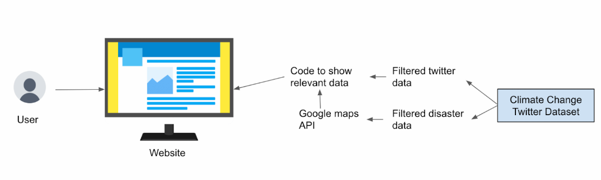

# Climate Change Pulse

_An interactive web application for exploring climate change data through natural language queries and visualization._

## Overview

Climate Change Pulse is a comprehensive web application that combines natural disaster data and social media sentiment analysis to provide insights into climate change impacts. Users can interact with the data through natural language queries and visualize information on interactive maps.



## Workspace Structure

```
climatechangepulse.github.io/
├── server/                     # Python backend server
│   ├── app.py                 # Main Flask application
│   └── requirements.txt       # Python dependencies
├── data/                      # Data files
│   ├── disasters_FINAL.csv    # Natural disaster records
│   └── finalized_tweets.csv   # Social media sentiment data
├── home.html                  # Main frontend interface
├── main-index.html           # Entry point with redirect
└── README.md                 # This file
```

## Backend Server Features (`server/`)

The Python backend built with Flask provides the following capabilities:

### Database Management
- **In-Memory SQLite Database**: Automatically loads CSV data into SQLite tables on startup
- **Dual Dataset Support**: 
  - `disasters` table: Natural disaster records with location, damage, casualties, and economic impact
  - `tweets` table: Social media data with sentiment analysis, geolocation, and user demographics

### Natural Language Processing
- **Query Classification**: Determines whether user questions relate to disaster data or social media sentiment
- **SQL Generation**: Converts natural language queries to SQL using OpenRouter API (Meta LLaMA model)
- **Error Handling**: Implements retry logic with up to 3 attempts for query correction
- **Response Generation**: Provides natural language answers based on SQL query results

### API Endpoints
- `/chat`: POST endpoint for processing user queries
- Session management with conversation history
- CORS enabled for cross-origin requests
- Cookie-based session tracking

### Key Technologies
- Flask web framework
- pandas for data manipulation
- SQLite for data storage
- OpenRouter API for LLM integration
- Environment variable configuration

## Frontend Features (Root Directory)

The frontend provides an interactive user interface with the following components:

### Data Visualization
- **Interactive Maps**: Display disaster and tweet data with geographical visualization
- **Time-based Filtering**: Users can explore data across different time periods
- **Multi-layered Information**: Overlay disaster events with social media sentiment

### User Interface
- **Natural Language Chat**: Users can ask questions in plain English
- **Real-time Responses**: Immediate feedback from the backend API
- **Responsive Design**: Works across different screen sizes and devices

### Data Integration
- Disaster data visualization showing:
  - Event locations and magnitudes
  - Economic damage and casualties
  - Temporal patterns and trends
- Social media sentiment display featuring:
  - Geographic distribution of climate-related discussions
  - Sentiment analysis (positive/negative/neutral)
  - User demographics and engagement levels

## Key Features

### For Researchers and Analysts
- Query historical disaster data using natural language
- Analyze correlations between disasters and public sentiment
- Export and visualize data trends over time

### For General Users
- Explore climate change impacts in their region
- Understand public opinion on climate issues
- Access complex data through simple conversational interface

### Data Sources
- **Disaster Database**: Comprehensive records of natural disasters including earthquakes, floods, hurricanes, and wildfires
- **Social Media Analysis**: Processed Twitter data with sentiment scoring and geographic tagging
- **Real-time Processing**: Dynamic SQL query generation and execution

## Getting Started

1. **Backend Setup**:
   ```bash
   cd server
   pip install -r requirements.txt
   python app.py
   ```

2. **Frontend Access**:
   - Open `home.html` in a web browser
   - Or use `main-index.html` which automatically redirects

3. **Environment Configuration**:
   - Set `OPENROUTER_API_KEY` in your environment variables
   - Ensure data files are available in the `data/` directory

## Technology Stack

- **Backend**: Python, Flask, SQLite, pandas
- **Frontend**: HTML, CSS, JavaScript
- **AI/ML**: OpenRouter API (Meta LLaMA)
- **Data**: CSV files with disaster and social media data
- **Deployment**: Designed for GitHub Pages hosting

---

*This application demonstrates the intersection of climate science, social media analysis, and natural language processing to make complex environmental data accessible to everyone.*
